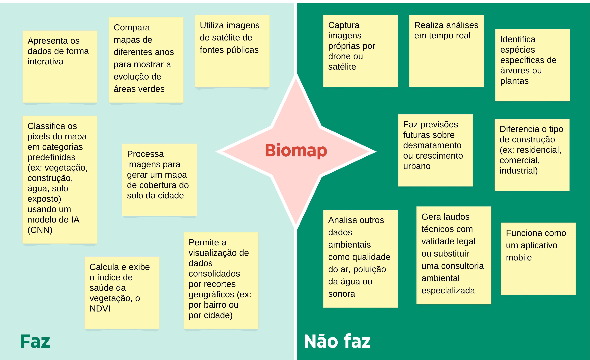
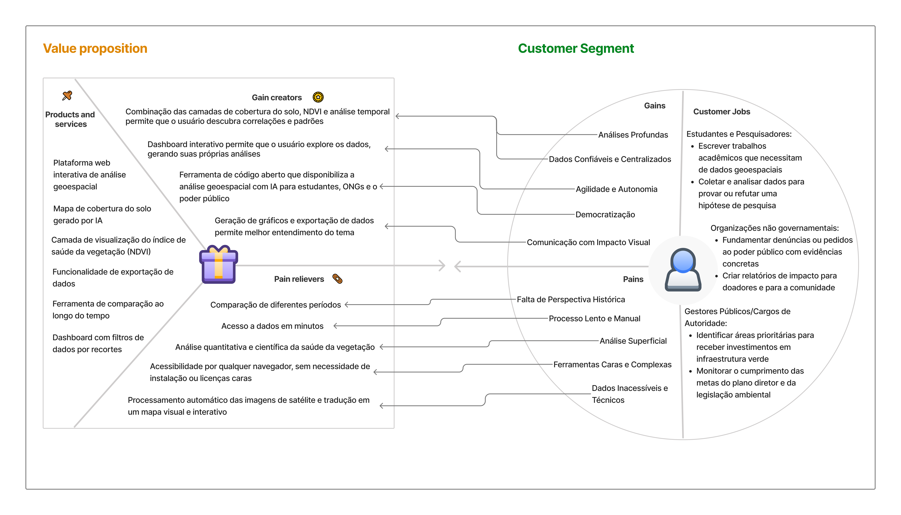

# Artefato 1: Ideação

## 1. Título: Biomap

## 2. Objetivo do Projeto

&nbsp;&nbsp;&nbsp;&nbsp;O projeto busca resolver um problema comum: a falta de informações claras e fáceis de usar sobre as áreas verdes nas cidades. Isso dificulta que a população participe de decisões importantes sobre o ambiente urbano, pois os dados são muito técnicos. A ferramenta foi pensada para ajudar moradores, estudantes, ONGs e até mesmo as prefeituras a entenderem melhor a cidade. Para isso, a Inteligência Artificial é a peça central. Usaremos um modelo de Rede Neural Convolucional que funciona como um "analista digital": ele aprende a olhar para fotos de satélite e a identificar, ponto a ponto, o que é vegetação, construção ou água, criando automaticamente mapas detalhados e fáceis de interpretar.

## 3. Descrição do Projeto

### Escopo da Solução

  Figura X - Matriz Faz e Não faz 
    
  
    
  Fonte: Material produzido pela autora (2025)

### Problema do Público-Alvo

&nbsp;&nbsp;&nbsp;&nbsp;Embora o problema central seja a barreira de acesso à informação, a forma como essa dificuldade se manifesta varia. Cada segmento do público-alvo enfrenta desafios e dores distintas que justificam a necessidade de uma solução versátil como a proposta.

#### Estudantes e Pesquisadores

&nbsp;&nbsp;&nbsp;&nbsp;Estudantes de áreas como Gestão Ambiental, Urbanismo, Geografia e Biologia enfrentam uma grande dificuldade para obter dados quantitativos e históricos para seus trabalhos acadêmicos. Eles necessitam de uma base de dados que lhes permita analisar tendências, comparar a evolução de diferentes bairros e fundamentar suas pesquisas com evidências concretas. A busca por esses dados hoje é um processo manual, demorado e frustrante, que envolve garimpar portais governamentais e lidar com formatos de arquivo complexos. Alguns estudantes foram entrevistados e um deles, Cauê Tavares Cabral Jorge, estudante de Gestão Ambiental, deu o seguinte relato:

    "Como estudante de Gestão Ambiental, uma das minhas maiores frustrações é a dificuldade de encontrar dados que vão além do óbvio. É fácil ver um parque no mapa, mas é quase impossível achar informações acessíveis que mostrem a saúde real daquela vegetação ou como a mancha verde do meu bairro mudou nos últimos cinco anos. Os dados existem, mas estão dispersos e em formatos muito técnicos para um trabalho rápido e prático."

#### Para ONGs Ambientais e Coletivos de Bairro

&nbsp;&nbsp;&nbsp;&nbsp;Organizações não governamentais e grupos de moradores engajados dependem de evidências para fortalecer suas ações de advocacia e conscientização. A "dor" desse público é a falta de ferramentas para provar suas teses. Eles podem perceber que uma área está sendo desmatada ou que seu bairro sofre com altas temperaturas, mas não conseguem apresentar um relatório com dados claros para a prefeitura, para a mídia ou para potenciais doadores. A necessidade deles é por uma plataforma que transforme suas percepções em argumentos visuais e quantitativos, ajudando a direcionar a criação de projetos ambientais e a mobilizar a comunidade.

#### Para Gestores Público

&nbsp;&nbsp;&nbsp;&nbsp;Embora possam ter mais acesso aos dados brutos, os técnicos e gestores de secretarias municipais (como a do Verde e Meio Ambiente) enfrentam desafios de eficiência e comunicação. O processo para gerar um único mapa de análise de vegetação pode ser demorado e exigir softwares caros e equipes especializadas. Além disso, há uma grande dificuldade em comunicar o progresso das políticas ambientais para o público geral de forma transparente e compreensível. Eles precisam de uma solução que otimize o tempo de análise e que gere dashboards e visualizações claras para prestação de contas e para o planejamento estratégico de novas intervenções urbanas.

### Proposta de Valor com IA

  Figura X - Matriz Faz e Não faz 
    
  
    
  Fonte: Material produzido pela autora (2025)

### Impacto Esperado

### Relevância e Atualidade

## 4. Análise de Mercado

### Design Research Methodology (DRM)

### Customer Development

### Análise TAM, SAM, SOM
* **TAM (Total Addressable Market):** * **SAM (Serviceable Available Market):** * **SOM (Serviceable Obtainable Market):** 

## 5. Público-Alvo

### Persona 1: [Nome Fictício da Persona]
* **Dados demográficos e contextuais:** * **Perfil tecnológico e educacional:** * **Dores e Problemas:** * **Objetivos:** * **Adequação da Solução:** ### Persona 2: [Nome Fictício da Persona]
* **Dados demográficos e contextuais:** * **Perfil tecnológico e educacional:** * **Dores e Problemas:** * **Objetivos:** * **Adequação da Solução:** ## 6. Requisitos do Sistema

### 6.1 Requisitos Funcionais
| Código | Descrição da Funcionalidade | Prioridade | Observações Técnicas Relevantes |
| :--- | :--- | :--- | :--- |
| RF01   |                              |            |                                 |
| RF02   |                              |            |                                 |
| RF03   |                              |            |                                 |
| RF04   |                              |            |                                 |
| RF05   |                              |            |                                 |
| RF06   |                              |            |                                 |

### 6.2 Requisitos Não Funcionais
| Código | Descrição Clara do Requisito | Tipo do Requisito | Observações Complementares |
| :--- | :--- | :--- | :--- |
| RNF01  |                              |                   |                            |
| RNF02  |                              |                   |                            |
| RNF03  |                              |                   |                            |
| RNF04  |                              |                   |                            |

## 7. Componente de Inteligência Artificial

### 7.1 Técnica de IA Aplicada
### 7.2 Justificativa da Técnica
### 7.3 Métricas de Avaliação
## 8. Orçamento Estimado (Se aplicável)
| Item de Custo | Descrição | Custo Estimado (R$) |
| :--- | :--- | :--- |
| Infraestrutura de Hospedagem | Custos com serviços de nuvem (ex: Google Cloud, AWS). | |
| Licenciamento de APIs/Modelos | Se aplicável, custo de uso de APIs de terceiros. | |
| Outros Custos Operacionais | Custos com domínios, ferramentas, etc. | |
| **Total Estimado** | **Soma de todos os custos.** | **R$ 0,00** |