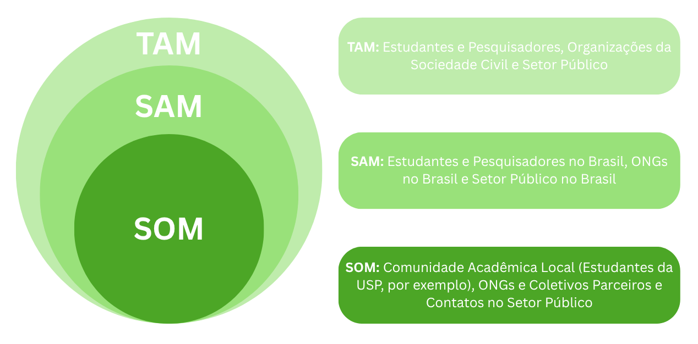

# Artefato 1: Ideação

## 1. Título: Biomap

## 2. Objetivo do Projeto

&nbsp;&nbsp;&nbsp;&nbsp;O projeto busca resolver um problema comum: a falta de informações claras e fáceis de usar sobre as áreas verdes nas cidades. Isso dificulta que a população participe de decisões importantes sobre o ambiente urbano, pois os dados são muito técnicos. A ferramenta foi pensada para ajudar moradores, estudantes, ONGs e até mesmo as prefeituras a entenderem melhor a cidade. Para isso, a Inteligência Artificial é a peça central. Será usado um modelo de Rede Neural Convolucional que funciona como um "analista digital": ele aprende a olhar para fotos de satélite e a identificar, ponto a ponto, o que é vegetação, construção ou água, criando automaticamente mapas detalhados e fáceis de interpretar.

## 3. Descrição do Projeto

&nbsp;&nbsp;&nbsp;&nbsp;A matriz 'Faz / Não Faz' a seguir apresenta o escopo do projeto Biomap. Ela define as funções da solução e o que não faz parte desta fase do projeto.

### 3.1. Escopo da Solução

  Figura 1 - Matriz Faz e Não faz 
    
  
    
  Fonte: Material produzido pela autora (2025)

&nbsp;&nbsp;&nbsp;&nbsp;O projeto é uma plataforma de análise e visualização de dados. A solução processa imagens de satélite de fontes públicas com um modelo de Inteligência Artificial para classificar a cobertura do solo em categorias como vegetação e água. A plataforma também calcula o índice de saúde da vegetação (NDVI) e apresenta os dados de forma interativa. O usuário pode filtrar por recortes geográficos, como bairros, e comparar a evolução das áreas verdes ao longo dos anos.

&nbsp;&nbsp;&nbsp;&nbsp;O que a ferramenta não faz também é importante para definir o escopo. O projeto não captura imagens próprias por drone nem faz análises em tempo real, pois foca em dados históricos. Sua capacidade de análise é descritiva, sem fazer previsões sobre desmatamento. A solução não identifica espécies de plantas ou tipos de construção, não gera laudos com validade legal e, nesta fase inicial, será uma plataforma web, não um aplicativo para celular.

### 3.2. Problema do Público-Alvo

&nbsp;&nbsp;&nbsp;&nbsp;A dificuldade de acesso à informação afeta cada público de uma forma diferente. Cada segmento enfrenta desafios e necessidades que justificam uma solução como a proposta.

#### 3.2.1. Estudantes e Pesquisadores

&nbsp;&nbsp;&nbsp;&nbsp;Estudantes de Gestão Ambiental, Urbanismo, Geografia e Biologia têm dificuldade para obter dados quantitativos e históricos para seus trabalhos acadêmicos. Eles precisam de uma base de dados para analisar tendências, comparar a evolução de bairros e fundamentar suas pesquisas. A busca por esses dados hoje é um processo manual e demorado, que envolve pesquisar em portais de governo e lidar com formatos de arquivo complexos.

#### 3.2.2. Para ONGs Ambientais e Coletivos de Bairro

&nbsp;&nbsp;&nbsp;&nbsp;Organizações não governamentais e grupos de moradores precisam de evidências para fortalecer suas ações. A dificuldade deste público é a falta de ferramentas para provar o que defendem. Eles podem notar que uma área está sendo desmatada ou que o bairro sofre com altas temperaturas, mas não conseguem apresentar um relatório com dados claros para a prefeitura ou para a mídia. Eles precisam de uma plataforma que transforme suas percepções em argumentos visuais e quantitativos para direcionar projetos e mobilizar a comunidade.

#### 3.2.3. Para Gestores Público

&nbsp;&nbsp;&nbsp;&nbsp;Técnicos e gestores de secretarias municipais, mesmo com acesso a dados brutos, enfrentam desafios de eficiência e comunicação. O processo para gerar um mapa de análise de vegetação pode levar tempo e exigir softwares caros e equipes especializadas. Existe também a dificuldade de comunicar o andamento de políticas ambientais para o público de forma transparente. Eles precisam de uma solução que otimize o tempo de análise e gere painéis visuais para prestação de contas e planejamento de novas ações urbanas.

### 3.3. Proposta de Valor

&nbsp;&nbsp;&nbsp;&nbsp;A ferramenta a seguir mapeia as dificuldades, ganhos e tarefas dos usuários e mostra como os recursos do Biomap atuam para aliviar essas dificuldades e gerar os ganhos esperados, alinhando o problema à solução.

  Figura 2 - Canvas de Proposta de Valor 
    
  
    
  Fonte: Material produzido pela autora (2025)

&nbsp;&nbsp;&nbsp;&nbsp;A proposta de valor responde às dificuldades e aos objetivos do público-alvo, formado por estudantes, ONGs e gestores públicos. O perfil desses usuários mostra uma frustração comum: a necessidade de fazer pesquisas, monitoramento ambiental e planejamento urbano é barrada por dados inacessíveis e ferramentas complexas. O processo para obter e analisar informações geoespaciais é lento, manual e exige um conhecimento técnico que a maioria não tem, o que leva a análises superficiais e à falta de uma perspectiva histórica.

&nbsp;&nbsp;&nbsp;&nbsp;O núcleo de IA da plataforma resolve a dificuldade de lidar com dados técnicos ao processar e traduzir imagens de satélite em um mapa visual e interativo. O obstáculo das ferramentas caras e complexas é eliminado por uma solução de código aberto, acessível por navegador, sem necessidade de licenças ou instalações. A lentidão e a falta de perspectiva histórica são combatidas pelas funções de comparação ao longo do tempo e pela agilidade da plataforma, que entrega análises em minutos. Ao resolver esses problemas, a solução gera ganhos, como o painel interativo que dá autonomia ao usuário e a combinação de camadas de dados que permite análises profundas. O resultado é a democratização da informação ambiental.

### 3.4. Impacto Esperado

&nbsp;&nbsp;&nbsp;&nbsp;O Biomap busca democratizar o acesso à informação ambiental urbana. Ao fornecer evidências visuais e quantitativas de forma acessível, a plataforma pode capacitar públicos como ONGs e estudantes, oferecendo uma base sólida para suas pesquisas e ações. Isso deve gerar um debate público mais qualificado sobre a qualidade ambiental nas cidades. O sucesso do projeto será medido por sua utilidade e sua contribuição para cidades mais sustentáveis.

### 3.5. Relevância e Atualidade

&nbsp;&nbsp;&nbsp;&nbsp;A relevância do Biomap surge do desafio da urbanização global. As cidades, que abrigam mais da metade da população mundial, continuam a se expandir. No Brasil, essa realidade é ainda mais forte, com mais de 85% da população em áreas urbanas, segundo o IBGE [[1]](#referências) [[2]](#referências). Esse crescimento, embora signifique desenvolvimento, muitas vezes ocorre de forma desordenada e pressiona os ecossistemas. A consequência é a impermeabilização do solo e a perda de áreas verdes, substituídas por concreto, o que torna o cenário urbano mais vulnerável.

&nbsp;&nbsp;&nbsp;&nbsp;A diminuição da vegetação nas cidades não é um problema estético, mas uma questão de saúde pública e resiliência ao clima. A Sociedade Brasileira de Arborização Urbana (Sbau) recomenda um mínimo de 15m² de área verde por habitante, um índice que muitas cidades brasileiras não atingem [[3]](#referências). A arborização urbana é um serviço ecossistêmico eficiente: um estudo da revista Nature Communications aponta que árvores podem reduzir a temperatura das cidades em até 12°C, combatendo o efeito de ilha de calor [[4]](#referências). A vegetação também ajuda na drenagem da chuva, reduzindo o risco de enchentes, e melhora a saúde mental e física da população [[5]](#referências).

&nbsp;&nbsp;&nbsp;&nbsp;Nesse cenário, monitorar e gerir a infraestrutura verde é uma prioridade. Os métodos tradicionais de mapeamento são caros, lentos e nem sempre acompanham a dinâmica das cidades. A relevância do Biomap surge para preencher essa lacuna. O projeto usa tecnologias atuais e acessíveis, como dados abertos de satélites e Inteligência Artificial, para criar uma solução ágil e de baixo custo. A proposta não é apenas gerar dados, mas democratizá-los, oferecendo uma ferramenta que permite a qualquer cidadão, ONG ou gestor público entender e agir sobre a realidade ambiental de seu território.

## 4. Análise de Mercado

### 4.1. Design Research Methodology (DRM)

&nbsp;&nbsp;&nbsp;&nbsp;Foi feita uma pesquisa de mercado com a metodologia DRM para guiar o desenvolvimento do Biomap. O objetivo é garantir que a solução seja relevante e atenda às necessidades do público. O processo seguiu quatro etapas: Setor, Pesquisa, Hipótese e Validação.

#### 4.1.1. Setor (Definição de Objetivo e Escopo)
&nbsp;&nbsp;&nbsp;&nbsp;Nesta fase, o objetivo é delimitar o universo da pesquisa.

- Objetivo Geral: Investigar como a aplicação de Inteligência Artificial e dados de sensoriamento remoto pode democratizar o acesso à informação ambiental urbana, capacitando a sociedade civil e melhorando a transparência na gestão pública.

- Escopo do Setor: O projeto se insere na intersecção de três setores: Tecnologia Cívica (Civic Tech), Geoprocessamento e Sensoriamento Remoto, e Sustentabilidade Urbana.

- Delimitação: A solução foca na análise de infraestrutura verde em áreas urbanas no Brasil. Serão usadas apenas imagens de satélite de fontes públicas e gratuitas (como o programa Sentinel). Estão fora do escopo inicial a análise de áreas rurais, o monitoramento de fauna, a análise de poluição e o uso de imagens de fontes privadas ou de drones.

#### 4.1.2. Pesquisa (Mapeamento do Setor)

&nbsp;&nbsp;&nbsp;&nbsp;Esta etapa consiste em investigar o cenário atual para entender os atores, as ferramentas existentes e as lacunas que o Biomap pode preencher.

##### Atores Envolvidos

- Órgãos Públicos: Secretarias Municipais do Verde e Meio Ambiente, de Urbanismo, subprefeituras.

- Sociedade Civil Organizada: ONGs ambientais de grande porte (ex: SOS Mata Atlântica, WWF Brasil) e coletivos de bairro.

- Comunidade Acadêmica: Universidades e institutos de pesquisa (INPE, Embrapa Territorial).

&nbsp;&nbsp;&nbsp;&nbsp;Para entender melhor as dificuldades, foram realizadas conversas com atores do setor, como [Ex: Cauê Tavares Cabral Jorge e Gyovanna Bevenuto, estudantes de Gestão Ambiental na Universidade de São Paulo].

&nbsp;&nbsp;&nbsp;&nbsp;A conversa com Cauê validou a hipótese do projeto sobre a dificuldade de acesso a dados. Questionado sobre os desafios em seus trabalhos, ele relatou:

  > "O maior problema é a questão dos dados. É muito difícil encontrar o material para você começar a falar alguma coisa... Entender o território já é um trabalho complicado, mas com esses dados bem desatualizados é bem difícil. Tive que fazer uma caracterização [de território] um tempo atrás e tinha muitos dados que eu não conseguia acesso, tive que procurar outras maneiras."
  
  — Cauê Tavares Cabral Jorge, estudante de Gestão Ambiental (USP).

&nbsp;&nbsp;&nbsp;&nbsp;Da mesma forma, a conversa com Débora Pontalti Marcondes, coordenadora na UMAPAZ (Secretaria do Verde e Meio Ambiente de São Paulo), revelou uma dificuldade sentida na gestão pública: tornar os dados compreensíveis para a população.

  > "A prefeitura de São Paulo ela é bem transparente, ela tem o dado lá, mas quem sabe ler aquele dado e transformar em informação, né? Então, o dado está público, mas será que ele está público de uma forma compreensível para todas as comunidades, para todos os coletivos, para que alunos de escola consigam ler e interpretar aquele dado?"

  — Débora Pontalti Marcondes, Secretaria Municipal do Verde e do Meio Ambiente (UMAPAZ).

##### Soluções existentes

- Publicações Científicas: Artigos com análises de áreas específicas, mas que não são ferramentas contínuas ou interativas.

- Portais Governamentais (Ex: GeoSampa): O GeoSampa é o portal de dados geoespaciais da cidade de São Paulo. Embora oficial, apresenta barreiras. Sua atuação é restrita a São Paulo. Além disso, a experiência de uso é pouco intuitiva, com uma interface que exige esforço para encontrar e baixar dados. Funciona mais como um repositório de dados brutos do que como uma ferramenta de análise para o público geral.

- Softwares SIG Profissionais (Ex: ArcGIS e QGIS): São as ferramentas padrão do mercado para análise geoespacial.

  - ArcGIS: É um software poderoso, mas sua principal barreira é o custo, com licenças que o tornam inviável para estudantes, ONGs e cidadãos.

  - QGIS: É a alternativa de código aberto ao ArcGIS. Embora gratuito, impõe duas barreiras. A primeira é a instalação, que pode ser confusa para usuários não técnicos. A segunda é sua curva de aprendizado. A interface é densa e exige conhecimento prévio em cartografia e geoprocessamento.

&nbsp;&nbsp;&nbsp;&nbsp;A lacuna no mercado é a falta de uma ferramenta que ocupe o meio-termo entre a complexidade dos softwares SIG e a limitação dos portais de dados. É aqui que a Inteligência Artificial se torna a tecnologia chave. Falta uma solução que use modelos de IA para automatizar a análise, como a classificação de cobertura do solo e o cálculo de NDVI, e entregar ao usuário não especializado um resultado processado, visual e intuitivo via web.

#### 4.1.3 Hipótese (Formulação de Modelos e Ferramentas)

&nbsp;&nbsp;&nbsp;&nbsp;Com base na pesquisa, foi formulada uma hipótese sobre como a solução pode gerar valor.

- Hipótese: "Se for desenvolvida uma plataforma web de código aberto que automatiza a análise de dados de satélite com Inteligência Artificial, então estudantes, ONGs e gestores públicos conseguirão extrair informações sobre o status ambiental urbano de forma rápida e intuitiva, capacitando-os a participar do debate público com mais embasamento."

- Modelo da Solução Proposta: Para testar a hipótese, propõe-se o desenvolvimento de uma plataforma web com:

  - Módulo de Aquisição de Dados: Integração com Google Earth Engine para acesso ao acervo do satélite Sentinel-2.

  - Módulo de IA: Um modelo de Rede Neural Convolucional para segmentação semântica da cobertura do solo.

  - Módulo de Análise: Funções para cálculo de NDVI e detecção de mudanças temporais.

  - Módulo de Visualização: Um dashboard interativo com mapas, filtros por região e exportação de dados.

#### 4.1.4 Validação (Plano de Teste da Hipótese)

&nbsp;&nbsp;&nbsp;&nbsp;A fase final da DRM descreve o plano para testar a hipótese do projeto antes do início do desenvolvimento.

- Verificação do Problema: O primeiro passo é confirmar as dificuldades identificadas na pesquisa. Isso será feito por meio de conversas com o público-alvo sobre seus processos de trabalho, sem apresentar a solução para evitar viés. Essa etapa já foi iniciada.

- Teste do Conceito da Solução: Após confirmar o problema, o passo seguinte é testar a aceitação do conceito do Biomap. O plano é criar um protótipo de baixa fidelidade (wireframes ou mockups) para apresentar aos usuários. O objetivo é avaliar se a proposta de valor é clara e se as funções são vistas como relevantes.

- Ciclo de Aprendizado: As informações coletadas nas duas etapas vão refinar a hipótese e o escopo do projeto. Este ciclo garante que o desenvolvimento futuro esteja alinhado às necessidades dos usuários.

### 4.2. Customer Development

&nbsp;&nbsp;&nbsp;&nbsp;Para detalhar a etapa de "Validação" da DRM, a metodologia de Customer Development será usada para garantir que o projeto se baseie em necessidades reais do mercado. O processo foca nas duas primeiras fases:

#### 4.2.1. Customer Discovery

&nbsp;&nbsp;&nbsp;&nbsp;O objetivo desta fase é validar a hipótese do problema. A meta é descobrir se as dificuldades e tarefas identificadas na pesquisa são reais e importantes para o público. O método consiste em entrevistas qualitativas com o público-alvo, focadas em suas experiências, sem apresentar a ideia da solução.

Hipóteses a serem testadas:

- H1 (da Dor): Estudantes e ONGs sentem que a dificuldade de acesso a dados ambientais é um obstáculo que prejudica seus trabalhos.
  - Status: Validada.
  - Comprovação: As entrevistas confirmaram que o acesso a dados é a principal barreira. O estudante Cauê Tavares descreveu como "o maior problema" a tarefa de "encontrar o material para você começar a falar alguma coisa". A gestora Débora Pontalti relatou que dados críticos estão perdidos em arquivos, o que mostra que a dificuldade existe tanto no meio acadêmico quanto no setor público.

- H2 (da Ferramenta Atual): As soluções existentes são vistas como inadequadas pela maioria do público, seja pelo custo, complexidade ou limitação.
  - Status: Validada.
  - Comprovação: Ambos os entrevistados confirmaram a ineficácia das soluções atuais para o público geral. A complexidade de ferramentas como o GeoSampa foi um ponto central, descrito por Débora Pontalti como um dado que "está público, mas não de uma forma compreensível". O custo e a curva de aprendizado de softwares SIG foram confirmados como barreiras para usuários não especializados.

- H3 (do Desejo): Existe um desejo por uma solução que vá além de um mapa estático, oferecendo análises como saúde da vegetação e evolução temporal.
  - Status: Validada.
  - Comprovação: O desejo por análises mais profundas foi claro. Cauê Tavares citou a "visão histórica" como "crucial" e a "comparação" entre locais como ideal. A gestora Débora Pontalti classificou a ideia da análise histórica e do recorte por espaços como "incrível", reforçando a necessidade de ir além de um mapa estático.

#### 4.2.2. Customer Validation

&nbsp;&nbsp;&nbsp;&nbsp;Com as hipóteses do problema validadas, esta etapa busca validar a hipótese da solução. O objetivo é testar se o Biomap é a solução correta para os problemas identificados. O método se baseia no desenvolvimento de um Protótipo de Baixa Fidelidade para ser apresentado em uma nova rodada de conversas.

Hipóteses a serem testadas:

- H4 (do Valor): Ao ver o protótipo, os usuários percebem o valor de uma plataforma que automatiza a análise de imagens de satélite com IA.

- H5 (da Usabilidade): Os usuários conseguem entender o dashboard interativo e navegar pelas funções principais sem um treinamento longo.

- H6 (da Adoção): Os usuários expressam interesse em utilizar a ferramenta em seus projetos, confirmando a adequação da solução ao mercado.

### 4.3. Análise TAM, SAM, SOM

&nbsp;&nbsp;&nbsp;&nbsp;A análise TAM, SAM, SOM dimensiona o público potencial do projeto. Como uma iniciativa de código aberto, o mercado é medido em público potencial, não em receita. O diagrama e o detalhamento ilustram o universo total de usuários (TAM), o segmento que pode ser atendido no Brasil (SAM) e a meta de adoção inicial (SOM).

  Figura 3 - Canvas do TAM, SAM, SOM 
    
  
    
  Fonte: Material produzido pela autora (2025)

#### 4.3.1. TAM (Total Addressable Market)

&nbsp;&nbsp;&nbsp;&nbsp;O TAM representa o mercado máximo de usuários que poderiam se beneficiar de uma ferramenta de análise de dados ambientais urbanos. Este mercado é global.

- Estudantes e Pesquisadores: Milhões de estudantes universitários em cursos de Urbanismo, Arquitetura, Biologia, Gestão Ambiental e Geografia no mundo.

- Organizações da Sociedade Civil: Dezenas de milhares de ONGs e coletivos com foco ambiental em escala global.

- Setor Público: Centenas de milhares de municípios no mundo com departamentos de planejamento urbano e meio ambiente.

#### 4.3.2. SAM (Serviceable Available Market)

&nbsp;&nbsp;&nbsp;&nbsp;O SAM é a parte do TAM que o Biomap pode atender, considerando as barreiras iniciais de idioma (português) e contexto (cidades brasileiras).

- Estudantes e Pesquisadores no Brasil: Número total de estudantes de graduação e pós-graduação em cursos relacionados no país.

- ONGs no Brasil: Número de Organizações da Sociedade Civil ativas com foco em meio ambiente e desenvolvimento urbano no país.

- Setor Público no Brasil: Número de municípios brasileiros, em especial os de médio e grande porte.

#### 4.3.3. SOM (Serviceable Obtainable Market)

&nbsp;&nbsp;&nbsp;&nbsp;O SOM representa a meta de adoção inicial do projeto, focando no ecossistema de São Paulo.

- Comunidade Acadêmica Local: Estudantes e professores do Inteli e de outras universidades em São Paulo (USP, Mackenzie) para usar a ferramenta em projetos acadêmicos.

- ONGs e Coletivos Parceiros: ONGs ou coletivos de bairro em São Paulo que foram entrevistados na fase de validação.

- Contatos no Setor Público: Secretarias municipais de São Paulo, buscando um projeto piloto ou o uso da plataforma.

## 5. Público-Alvo
&nbsp;&nbsp;&nbsp;&nbsp;Com base nas entrevistas e na pesquisa, foram desenvolvidas duas personas para representar os segmentos do público-alvo: Lucas Andrade, o 'Pesquisador', e Ana Clara Souza, a 'Gestora Pública'.

### 5.1. Persona 1: Lucas Andrade

  Figura 4 - Persona Lucas Andrade
    
  
    
  Fonte: Material produzido pela autora (2025)

&nbsp;&nbsp;&nbsp;&nbsp;Lucas é um jovem pesquisador que precisa de dados concretos, mas encontra informações precárias e de difícil acesso. Sua rotina é uma busca por informações, gastando muito tempo na coleta e tentativa de padronizar dados dispersos e em formatos complexos. Sua principal dificuldade é não conseguir fazer análises mais profundas, como a avaliação da saúde da vegetação ou a comparação histórica da mancha verde, que são importantes para seu estudo. Seu objetivo é superar essa barreira para poder se dedicar à análise e geração de conhecimento sobre os desafios urbanos.

### 5.2. Persona 2: Ana Clara Souza

  Figura 5 - Persona Ana Clara Souza
    
  
    
  Fonte: Material produzido pela autora (2025)

&nbsp;&nbsp;&nbsp;&nbsp;Ana Clara é uma profissional do setor público com visão estratégica, mas limitada por processos antigos e ferramentas ineficientes. Sua frustração é saber que a prefeitura tem muitos dados, mas eles estão "presos" em planilhas e sistemas antigos, o que torna a geração de relatórios uma tarefa lenta. Ela enfrenta o desafio de planejar políticas públicas sem uma visão clara do impacto das ações no território. O objetivo de Ana Clara é tornar a tomada de decisão do seu departamento mais ágil e transparente, usando dados para comunicar o status ambiental da cidade e para basear um planejamento urbano mais sustentável.

## 6. Requisitos do Sistema

&nbsp;&nbsp;&nbsp;&nbsp;Os requisitos do sistema, definidos a partir do escopo do projeto, orientam o desenvolvimento técnico. Eles são divididos em Requisitos Funcionais, que descrevem 'o que' o sistema deve fazer, e Requisitos Não Funcionais, que definem 'como' o sistema deve operar.

### 6.1 Requisitos Funcionais

| Código | Descrição da Funcionalidade | Prioridade | Observações Técnicas Relevantes |
| :--- | :--- | :--- | :--- |
| RF01   | Visualizar um mapa-base interativo da área selecionada. | Alta | Utilizar uma API de mapas como OpenStreetMap ou Google Maps. Implementar funções de zoom e pan. |
| RF02   | Selecionar e visualizar dados de uma localidade específica. | Alta | O usuário deve poder, através de um único campo de busca ou menu, focar o mapa e os dados em uma localidade. |
| RF03   | Processar e classificar imagens de satélite com IA. | Alta | O sistema deve processar uma imagem de satélite de uma área e, utilizando a Rede Neural Convolucional (CNN), gerar uma camada de segmentação semântica, classificando cada pixel em categorias como vegetação, construção, água, etc. |
| RF04   | Calcular índices de saúde da vegetação. | Alta | O sistema deve ser capaz de calcular o índice NDVI para uma área selecionada, utilizando as bandas espectrais da imagem de satélite para gerar uma camada de visualização que representa a saúde e a densidade da vegetação. |
| RF05   | Realizar Análise de Detecção de Mudanças ao longo do tempo. | Média | O sistema deve ser capaz de comparar duas camadas de classificação de IA de anos diferentes para identificar e quantificar as áreas onde ocorreram mudanças (ex: ganho ou perda de vegetação). |
| RF06   | Agregar dados pós-análise para geração de estatísticas. | Alta | Após a IA classificar os pixels, o sistema deve agregar esses dados para gerar as estatísticas que alimentarão os dashboards (ex: "Bairro X tem 27% de área verde"). |
| RF07   | Comparar os dados de duas ou mais localizações diferentes. | Média | Permitir que o usuário adicione duas ou mais localidades a um painel para comparar seus indicadores lado a lado. |
| RF08   | Exportar a visualização do mapa e os dados estatísticos. | Baixa | Permitir o download da visualização atual (PNG) e dos dados agregados (CSV). |
| RF09   | Permitir o Treinamento e Atualização do Modelo de IA. | Alta | A plataforma deve possuir um módulo de backend que permita o re-treinamento do modelo de CNN com novos dados rotulados, visando a melhoria contínua da sua acurácia. |

### 6.2 Requisitos Não Funcionais

| Código | Descrição Clara do Requisito | Tipo do Requisito | Observações Complementares |
| :--- | :--- | :--- | :--- |
| RNF01  | A plataforma deve ser intuitiva e ter uma baixa curva de aprendizado. | Usabilidade | O fluxo principal de uso (selecionar cidade, ver mapa) deve ser completado sem necessidade de um tutorial, mesmo por um usuário leigo em geoprocessamento. |
| RNF02  | O mapa e as camadas de dados devem carregar em até 5 segundos. | Desempenho | Em uma conexão de internet padrão. Requer otimização no processamento e entrega dos dados geoespaciais. |
| RNF03  | O site deve ser funcional nas versões mais recentes dos navegadores. | Compatibilidade | Garantir funcionamento em Google Chrome, Mozilla Firefox e Microsoft Edge. O design deve ser responsivo para desktops e tablets. |
| RNF04  | A plataforma deve estar acessível publicamente 24/7. | Disponibilidade | O sistema deve ter uma alta disponibilidade (ex: 99% de uptime), garantida pela infraestrutura de nuvem. |
| RNF05  | A interface deve ter um design limpo e ser responsiva. | Usabilidade | O layout deve se adaptar para uma visualização clara em diferentes tamanhos de tela, como desktops, notebooks e tablets. |

## 7. Componente de Inteligência Artificial

### 7.1 Técnica de IA Aplicada

&nbsp;&nbsp;&nbsp;&nbsp;A técnica de Inteligência Artificial aplicada no projeto será a Segmentação Semântica com Aprendizado Supervisionado. Para isso, será utilizada uma Rede Neural Convolucional (CNN), um tipo de modelo de Aprendizado Profundo (Deep Learning) para análise de imagens. A arquitetura planejada é a U-Net, conhecida por sua eficácia na segmentação de imagens de satélite.

### 7.2 Justificativa da Técnica

&nbsp;&nbsp;&nbsp;&nbsp;A escolha da Segmentação Semântica com uma CNN U-Net se deve à natureza do problema. O objetivo não é apenas saber se uma imagem contém vegetação, mas identificar quais pixels exatos correspondem a vegetação, construções ou água. A segmentação semântica oferece essa classificação pixel a pixel, o que é essencial para criar mapas precisos e calcular áreas, baseando a análise quantitativa da plataforma. A arquitetura U-Net é eficaz pois sua estrutura permite que o modelo use informações de diferentes escalas, combinando o contexto geral da imagem com detalhes finos, algo importante para delimitar objetos em imagens de satélite. [[6]](#referências) [[7]](#referências) [[8]](#referências)

&nbsp;&nbsp;&nbsp;&nbsp;Outras alternativas foram consideradas, mas não atendem às necessidades do projeto pelos seguintes motivos:
- Machine Learning Clássico (ex: Random Forest, SVM): Métodos clássicos exigiriam a definição manual de características para cada pixel. Esse processo é demorado, menos escalável e, segundo a literatura, tem um desempenho inferior ao das Redes Neurais Convolucionais, que aprendem as melhores características de forma automática.

- Classificação de Imagem por Patches: Uma abordagem alternativa seria dividir a imagem em uma grade e classificar cada "quadrado" (patch). O problema dessa técnica é a perda de precisão nas fronteiras entre as classes. Seria impossível, por exemplo, delinear o contorno de um rio ou parque, o que levaria a cálculos de área imprecisos.

### 7.3 Métricas de Avaliação

&nbsp;&nbsp;&nbsp;&nbsp;Como o problema é de classificação pixel a pixel, as métricas de avaliação do modelo de IA vão medir a precisão dessa classificação em nível de pixel. As métricas serão:

- Intersection over Union (IoU) / Jaccard Index (Métrica Principal): É a métrica padrão para tarefas de segmentação. Ela calcula a razão entre a área de interseção (onde previsão e rótulo real concordam) e a área de união (área total da previsão e do rótulo). Um IoU próximo de 1 indica uma previsão quase perfeita. Será calculada a média do IoU (mIoU) entre todas as classes para uma medida geral do desempenho [[9]](#referências).

- Dice Coefficient (F1-Score): Similar ao IoU, o Coeficiente de Dice também mede a sobreposição entre a previsão e o gabarito, sendo outra métrica padrão para avaliar a acurácia da segmentação [[9]](#referências).

- Pixel Accuracy: Mede a porcentagem de pixels classificados corretamente. Será usada com cautela, pois pode ser enganosa em casos de classes desbalanceadas (ex: uma imagem com 95% de construções e 5% de água).

- Matriz de Confusão (por classe): Será utilizada para uma análise mais detalhada, permitindo ver para quais classes o modelo está acertando e errando mais. Por exemplo, podemos descobrir se o modelo confunde solo exposto com construções [[10]](#referências).

## 8. Orçamento Estimado (Se aplicável)

&nbsp;&nbsp;&nbsp;&nbsp;A estimativa de custos para o Biomap considera a fase inicial de desenvolvimento e validação, com duração de 3 a 6 meses. Nesta fase, o custo direto de infraestrutura e tecnologia é estimado em R$ 0,00. Este valor é possível pelo uso dos seguintes recursos:

- Créditos do Google Cloud Free Trial: Um saldo inicial para cobrir custos que excedam os níveis gratuitos.

- Nível Gratuito ("Always Free" Tier): A maioria dos serviços a serem usados possui uma camada de uso gratuito mensal, suficiente para um projeto em fase de validação.

- Cotas de Uso para Fins Não Comerciais: Ferramentas como o Google Earth Engine oferecem acesso gratuito para projetos de pesquisa e acadêmicos.

| Item de Custo | Descrição | Custo Estimado (R$) |
| :--- | :--- | :--- |
| Infraestrutura de Hospedagem | Hospedagem da aplicação web (Cloud Run), armazenamento de datasets e modelos (Cloud Storage) e banco de dados (BigQuery). | R$ 0,00 (Coberto pelo Nível Gratuito de cada serviço) |
| Treinamento e Inferência de IA | Uso da plataforma Vertex AI para treinar, testar e executar o modelo de CNN. | R$ 0,00 (Coberto pelo Nível Gratuito do Vertex AI e/ou créditos iniciais) |
| Acesso a APIs e Dados Geoespaciais | Uso da API do Google Earth Engine para processamento de imagens e da API do Google Maps para o mapa-base. | R$ 0,00 (Coberto pela cota de uso não comercial e pelo nível gratuito da API) |
| Outros Custos Operacionais | Registro de um domínio web para a plataforma (ex: biomap.org). | R$ 40,00 / ano |
| **Total Estimado** | **Soma dos custos diretos para a fase de prototipação.** | **R$ 40,00** |

## 8.2. Estimativa de Custo Pós-Período Inicial

&nbsp;&nbsp;&nbsp;&nbsp;Após o término do período de trial e o consumo dos créditos, a plataforma passaria a operar no modelo "pay-as-you-go". A arquitetura serverless planejada é eficiente em custos. A maior parte da infraestrutura possui um Nível Gratuito generoso, e para um tráfego de baixo a moderado, os custos devem ser nulos ou muito baixos. O custo variável virá quase todo do uso do Google Cloud Vertex AI para treinamento e inferência. Com base nisso, estimamos os seguintes cenários:

- Cenário de Baixa Utilização (Modo de Manutenção): Se a plataforma operar apenas para servir análises existentes a poucos usuários, sem novos treinamentos, o custo mensal tende a ser nulo ou inferior a R$ 50.

- Cenário de Uso Ativo (Pesquisa e Desenvolvimento): Em um cenário com um ou dois re-treinamentos de modelo por mês e processamento de novas áreas, a estimativa de custo mensal ficaria na faixa de R$ 150 a R$ 400.

&nbsp;&nbsp;&nbsp;&nbsp;Esses valores são estimativas e podem variar com o uso. A vantagem da arquitetura planejada é o controle de custos, garantindo que a despesa do projeto escale de forma proporcional à sua atividade, sem altos custos fixos.

## Referências

[1] ONU BRASIL. ONU-Habitat: população mundial será 68% urbana até 2050. Disponível em: https://brasil.un.org/pt-br/188520-onu-habitat-popula%C3%A7%C3%A3o-mundial-ser%C3%A1-68-urbana-at%C3%A9-2050. Acesso em: 30 jun. 2025.

[2] INSTITUTO BRASILEIRO DE GEOGRAFIA E ESTATÍSTICA (IBGE). Censo 2022: 87% da população brasileira vive em áreas urbanas. Agência de Notícias IBGE, 2023. Disponível em: https://agenciadenoticias.ibge.gov.br/agencia-noticias/2012-agencia-de-noticias/noticias/41901-censo-2022-87-da-populacao-brasileira-vive-em-areas-urbanas. Acesso em: 30 jun. 2025.

[3] ASSEMBLEIA LEGISLATIVA DO ESTADO DE SÃO PAULO. Benefícios das árvores para a população. Disponível em: https://www.al.sp.gov.br/noticia/?id=306090. Acesso em: 30 jun. 2025.

[4] REVISTA GALILEU. Árvores podem reduzir em até 12°C temperatura das cidades, diz estudo. Um Só Planeta, 2021. Disponível em: https://revistagalileu.globo.com/Um-So-Planeta/noticia/2021/11/arvores-podem-reduzir-em-ate-12c-temperatura-das-cidades-diz-estudo.html. Acesso em: 30 jun. 2025.

[5] G1 MATO GROSSO DO SUL. Presença de árvores ajuda na saúde mental da população. Cidade das Árvores, 29 nov. 2023. Disponível em: https://g1.globo.com/ms/mato-grosso-do-sul/cidade-das-arvores/noticia/2023/11/29/presenca-de-arvores-ajuda-na-saude-mental-da-populacao.ghtml. Acesso em: 30 jun. 2025.

[6] SUPERANNOTATE. A guide to semantic segmentation. Disponível em: https://www.superannotate.com/blog/guide-to-semantic-segmentation. Acesso em: 5 jul. 2025.

[7] ANALYTICS VIDHYA. Image segmentation with U-Net. 2022. Disponível em: https://www.analyticsvidhya.com/blog/2022/10/image-segmentation-with-u-net/. Acesso em: 5 jul. 2025.

[8] QUESADA, Alex. U-Net: A versatile deep learning architecture for image segmentation. Medium, 2023. Disponível em: https://medium.com/@alexquesada22/u-net-a-versatile-deep-learning-architecture-for-image-segmentation-2a85b52d71f6. Acesso em: 5 jul. 2025.

[9] KETA, Nachi. Computer Vision: IoU, Jaccard’s Index & Dice Score Coefficient. Medium, 2023. Disponível em: https://nachi-keta.medium.com/computer-vision-iou-jaccards-index-dice-score-coefficient-861c4a496b2b. Acesso em: 5 jul. 2025.

[10] ULTRALYTICS. Confusion Matrix. Disponível em: https://www.ultralytics.com/pt/glossary/confusion-matrix. Acesso em: 5 jul. 2025.